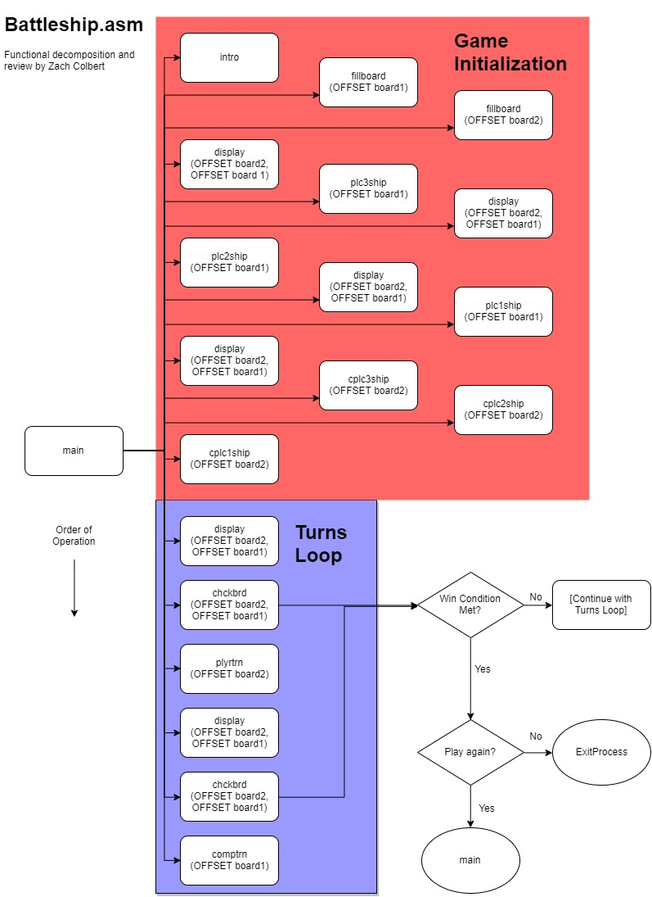

# Battleship.asm
**Zach Colbert**

_Code Review for CS 271 Final Project_

## Program Description
The Battleship program emulates the classic board game _Battleship_, in which players secretly arrange ships of various sizes on a grid and try to guess the placement of their opponent's ships. The player who sinks all of their opponent's ships first wins! This program pits a single player against the computer.

The program displays both the player's board and their "radar" screen, which shows the spaces on the opponent's board that the player has fired on already as hits or misses. After some initializing steps and ship placement the program loops through alternating player and computer turns, checking the board intermittently for win conditions. The game will continue to loop until a win condition is found, at which point it will print some text declaring a winner and offer to start a new game.

## Procedures and Functional Decomposition
### main
+ _Stack parameters:_ None
+ _Global variables:_ All
+ _Registers changed:_ All
+ _Returns:_ None

The main procedure pushes parameters and calls other procedures to initialize the game. It uses a simple `jmp` loop to cycle through computer and player turns, intermittently updating the board displayed in the console and checking for win conditions.

Although the main procedure has an `exit` instruction at the end, the program will actually exit from the chkbrd procedure if a win condition is found. Since the game is either wiped clean and restarted or ended entirely, I don't expect there to be any issues with the program exiting in an unexpected state.

### intro
+ _Stack parameters:_ None
+ _Global variables:_ `welcstr`, `seedstr`, `invstr`
+ _Registers changed:_ EAX, ECX, EDX, FLAGS
+ _Returns:_ Random unsigned integer in EAX

The intro procedure prints a welcome message, and prompts the user for a seed integer. This seed is used to generate a pseudo-random, unsigned integer which is returned in EAX. Finally, the procedure calls `WaitMsg` and clears the console before returning.

The author used a convenient method of validating user input which I was not aware of before. After calling `ReadDec` to get input, the author uses a conditional jump, `jnc`, checking the carry bit. Evidently, if the number retrieved by `ReadDec` is invalid, the carry bit is set to 1. 

To get a random number, the author uses Irvine's `RandomRange` procedure. What caught my attention was the lack of a call to the `Randomize` procedure anywhere in this program--as I understand it, the program could run multiple times with the same set of random numbers, and the user's choice of seed number is used to select a random number from the set. This could allow a user to select the same game conditions over multiple games by using the same seed number.

I was not previously aware of the `WaitMsg` procedure, but it appears to be a part of the Irvine library. It does the same thing as the Windows `pause` command, printing "Press any key to continue..." to the console and waiting for user input before continuing.

### fillboard
+ _Stack parameters:_ DWORD pointer to first board space in memory
+ _Global variables:_ None
+ _Registers changed:_ ESI, EAX, ECX, FLAGS
+ _Returns:_ Manipulates values in memory, no return value

The fillboard procedure takes a pointer to a game board in memory, and loops through each of the 25 DWORD spaces. The value of each space in memory is set to 0.

### display
+ _Stack parameters:_ DWORD pointer to computer board, DWORD pointer to player board
+ _Global variables:_ `brd2str`, `brdlets`, `strnnum`, `spcstr`, `obrkstr`, `xstr`, `ostr`, `cbrkstr`, `spcstr`, `brd1str`
+ _Registers changed:_ ESI, EDI, EDX, ECX, EAX, EBX, FLAGS
+ _Returns:_ Prints boards to console, no single return value

The display procedure is used repeatedly throughout the program to show the player's board and radar screen on the console. Every time something changes on one of these boards, the display procedure is called again to update what the player sees in their console.

It uses some simple instructions to print labels for each board, and loops to print each board space. Comparing to values in memory, it uses conditional jumps to print different characters for empty spaces, spaces occupied by a ship, spaces on which a ship has been hit, and spaces which have been fired on but are not occupied.

There is also a conditional jump which prints a newline character every 5 spaces, resulting in the 5x5 grid that makes up the board.

While this procedure does effectively push and pop the base pointer EBP, it does not clear all the parameters passed to it on the stack when returning to the calling function. The procedure ends with `ret 4`, but it should end with `ret 8` because it takes two DWORD (4-byte) stack parameters. This turns out not to be an issue because the main procedure does not pop any values from the stack after the display procedure ends, but is effectively a memory leak.

### Ship Placement Procedures
_plc3ship, plc2ship, plc1ship, cplc3ship, cplc2ship, cplc1ship_
+ _Stack parameters:_ DWORD pointer to board in memory
+ _Global variables:_ `rotstr`, `plc3str`, `plc2str`, `plc1str`, `plcvstr`, `hrzstr`, `invstr`, `vrtstr`, `plchstr`
+ _Registers changed:_ ESI, EDX, EAX, FLAGS, EBX, ECX, 
+ _Returns:_ Manipulates values in memory, no single return value

The procedures for player ship placement prompt the user to place each ship horizontally or vertically (except plc1ship), then prompt for coordinates at which to place the ship.

The procedures for computer ship placement use Irvine's RandomRange procedure to randomly place ships on the board. 

Both sets of procedures use some conditional jumps to validate placement of ships, ensuring that they are all within the 5x5 game board.

All of these procedures appear to set up and release their respective stack frames properly.

### plyrtrn
+ _Stack parameters:_ DWORD pointer to opponent's board in memory
+ _Global variables:_ `askstr`, `pegstr`, `invstr`, `hrzstr`, `vrtstr`, `mssstr`, `hitstr`
+ _Registers changed:_ ESI, EAX, EDX, FLAGS, EBX, ECX
+ _Returns:_ Manipulates value in memory, no single return value

The plyrtrn procedure prompts the player to enter coordinates to "fire" at. It uses conditional jumps to validate input, ensuring that it's on the grid and hasn't been fired on already.

If an opposing ship is present in the selected space, the procedure prints a message indicating a hit. Conversely, it prints a miss message if no ship is occupying the space.

This procedure initializes its stack frame correctly, but does not return properly at the end. It uses the instruction `ret 8`, despite having only 1 DWORD (4-byte) stack parameter. I am quite surprised that the program functions normally despite popping an extra 4 bytes from the stack on returning to the main procedure.

### comptrn
+ _Stack parameters:_ DWORD pointer to player's board in memory
+ _Global variables:_ `cmsssstr`, `chitstr`
+ _Registers changed:_ ESI, EAX, ECX, FLAGS, EBX, EDX
+ _Returns:_ Manipulates value in memory, no single return value

The comptrn procedure works largely like the plyrtrn procedure, but without prompts for coordinates. It uses the RandomRange procedure to randomly select coordinates to fire on, and uses conditional jumps to check for a hit or miss.

Also like the plyrtrn procedure, this procedure incorrectly releases its stack frame when returning to the calling procedure. It, too, uses the `ret 8` instruction when it should use `ret 4` as it only takes 1 DWORD (4-byte) stack parameter.

This procedure could be enhanced with some additional logic for making "smarter" guesses as to where the player's ships might be, instead of guessing entirely at random.

### chckbrd
+ _Stack parameters:_ DWORD pointer to computer board in memory, DWORD pointer to player board in memory
+ _Global variables:_ `winstr`, `losestr`, `agnstr`, `invstr`
+ _Registers changed:_ ESI, EDI, EAX, ECX, EBX, EDX, FLAGS
+ _Returns:_ None

The chkbrd procedure loops through the spaces on each board, counting the number of recorded hits. First checking the player board, if exactly 6 hits are counted the program prints a string declaring the player as the winner. Otherwise, the program checks the computer board. Again, if exactly 6 hits are counted the program prints a string declaring the player as the winner.

While there is a label and instructions for the case in which the computer wins, there is no jump instruction that points to that label. If 6 hits are counted on either board, the player is declared the winner every time. This is the only major bug I was able to identify in the program.

Finally, the program prompts the user to play again or end the program. There are instructions to gracefully return the procedure and properly free its stack frame, but those instructions are never reached because jump instructions either end up calling `main` again, or `invoke ExitProcess,0` to end the program.

## Direct Questions
### How did the programmers use registers? Do they use sub-registers?
I did not see any notable use of sub-registers in this program. General-purpose registers were used heavily throughout the program for counting, looping, arithmetic, and reading/writing values in memory.

The author did not attempt to preserve register values when calling/returning procedures, but this did not impact the functionality of the program and was probably more efficient overall than pushing and popping register values on the stack constantly.

### Which addressing mode did the programmers use?
Register-indirect addressing using ESI and EDI registers was most commonly used to access memory.

### Do the programmers use procedures? How do they implement parameter passing?
The author uses procedures very effectively, especially with the display procedure and player and computer turn procedures which can be used over and over again in a loop for continuous gameplay.

The author primarily uses stack parameters referencing memory locations, but relies heavily on global variables for printing strings to the console.

### Do the programmers use the stack?
Only for passing parameters to procedures.

### Do the programmers use constants and macros?
Only one constant is defined in the program, `max`, and is seldom used. Max is intended to be the maximum number of spaces on a game board.

No macros were implemented or called in the program.

### Do the programmers use the FPU?
The FPU is not used anywhere in this program.

### Are there any procedures or instructions that you did not learn in class?
The `WaitMsg` procedure was new to me, and I wrote about it in the section on the intro procedure.

### Are there any graphics? How do the programmers implement graphics?
The programmers have a thorough set of strings defined at the top of the program that are printed to the console to make a graphical interface.

### Do the programmers include enough documentation?
No. Procedures are not well-documented, and more inline comments would be useful throughout the program.